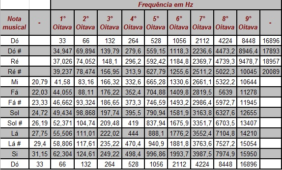

# Piano no FPGA
Simulador de piano no FPGA baseado no *Relatório - Tutorial do uso do CODEC de Áudio no Kit Altera DE2*. Nele foram modificados alguns parâmetros para se obter um piano com mais notas, frequências atualizadas e qualidade diferenciada.
## O que mudou
Foram adicionados Do#, Re#, Fa#, Sol#, La#. Algumas frequências também foram ajustadas para valores reais, baseados na tabela a seguir:

Foram escolhidos para os testes, os valores de frequência da 4º Oitava. Para efetivar a mudança foi necessário ajustar a quantidade de bits da variável *Octave*, pois nele são registrados todas as possibilidades de notas escolhidas baseado na escolha dos Switchs. Também foram modificados os leds para acender de acordo com as notas adicionais e posição das notas no teclado.

## Relevância das mudanças
Com as notas adicionadas e frequências ajustadas a qualidade do som foi melhorada e agora é possível criar diversos sons. Além disso, também é possível tocar uma gama maior de músicas!

## Referências
Código fonte pode ser encontrado [aqui](https://github.com/GRocha1/ProjetoCL2).